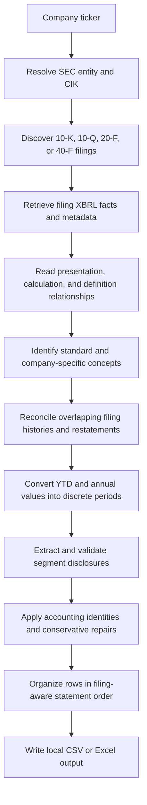

<div align="center">

# sec-data

### Open-source SEC financial statement extraction for Python

Convert SEC EDGAR filings into detailed, modelling-ready quarterly or annual financial statements stored locally as CSV or Excel files.

[](https://www.python.org/)
[](LICENSE)
[](https://www.sec.gov/edgar)
[](#output)
[](#why-sec-data)

</div>

> [!IMPORTANT]
> The primary supported workflow is **quarterly financial statement extraction for U.S. domestic filers using 10-Q and 10-K filings**. Annual extraction and foreign private issuer support are experimental.
>
> The code is 100% AI generated. From the sec_data.py to the index.html all of it is vibe coded!

<p align="center">
  
</p>

**sec-data** is an open-source Python financial data extraction engine. It retrieves company filings directly from the SEC EDGAR database and transforms XBRL facts, company-specific tags, filing linkbases, historical comparative data, and selected HTML tables into structured financial statements.

The result is a local dataset suitable for financial modelling, valuation, screening, research tools, dashboards, and other open-source financial applications.

## Contents

- [Why sec-data](#why-sec-data)
- [What it produces](#what-it-produces)
- [Quick start](#quick-start)
- [Command-line interface](#command-line-interface)
- [CLI arguments](#cli-arguments)
- [How it works](#how-it-works)
- [Output](#output)
- [Support status](#support-status)
- [Understanding sec-data](#understanding-sec-data)
- [Optional HTML application](#optional-html-application)
- [Limitations and verification](#limitations-and-verification)
- [License](#license)

---

## Why sec-data

SEC filings contain detailed financial information, but turning those filings into a consistent historical dataset is difficult.

A single company may use:

- Standard US-GAAP XBRL concepts
- Company-specific extension tags
- Different tags for the same line item across reporting periods
- Year-to-date values instead of discrete quarterly values
- Annual values that must be converted into a fourth quarter
- Restated historical periods
- Segment disclosures embedded in filing footnotes
- Inconsistent presentation and calculation relationships
- Different fiscal calendars and filing structures
- HTML tables when structured XBRL data is incomplete

Many financial-data platforms solve these problems through proprietary normalization systems and place the resulting data behind paid APIs, export limits, or closed databases.

**sec-data builds the financial dataset locally from the original SEC filings.**

It is designed for users who want:

- Direct access to filing-derived financial statements
- No recurring financial-data API dependency
- Local, editable CSV or Excel output
- Detailed company-specific line items
- Transparent extraction and reconciliation logic
- A foundation for open-source investment research tools

### What sec-data is not

sec-data is not a market-data terminal, brokerage platform, or complete global financial database. It does not currently provide analyst estimates, live market prices, earnings transcripts, or stable quarterly support for foreign private issuers.

Its stable core is focused on detailed U.S. quarterly financial statements.

---

## What it produces

| Output section | Description |
|---|---|
| **Period header** | Fiscal period labels and exact reporting-period ending dates |
| **Income statement** | Revenue, expenses, operating income, taxes, net income, EPS, shares, and company-specific rows |
| **Balance sheet** | Assets, liabilities, debt, equity, working capital, and disclosed components |
| **Cash-flow statement** | Operating, investing, and financing cash flows with discrete-quarter reconstruction |
| **Business segments** | Product, service, operating-segment, and reportable-segment financial data |
| **Geographic segments** | Regional and country-level revenue disclosures |
| **Cross-tabulated segments** | Multi-dimensional business and geographic disclosures when recoverable |
| **Disclosures** | Additional structured financial disclosures extracted from filings |
| **KPI metrics** | Calculated financial ratios and selected filing-derived metrics |
| **Integrity checks** | Internal reconciliation and accounting-identity diagnostics |

Generated files remain local and can be opened directly in spreadsheets, notebooks, databases, dashboards, or custom financial applications.

---

## Quick start

### 1. Clone the repository

```bash
git clone https://github.com/ichsan1448-alt/sec-data.git
cd sec-data
```

### 2. Install the dependencies

Python 3.10 or newer is recommended.

```bash
python3 -m pip install -r requirements.txt
```

On Windows:

```powershell
py -m pip install -r requirements.txt
```

### 3. Extract a company

```bash
python3 sec_data.py --ticker NFLX
```

On Windows:

```powershell
py sec_data.py --ticker NFLX
```

The generated CSV will be saved to:

```text
output/financials/NFLX_financials.csv
```

### Export to Excel

```bash
python3 sec_data.py --ticker NFLX --xlsx
```

The generated workbook will be saved to:

```text
output/financials/excel/NFLX_financials.xlsx
```

### First-run SEC identity

The first run asks for a name and email address for the SEC request `User-Agent`.

The identity is stored locally in the script cache and reused on later runs. It can be cleared with:

```bash
python3 sec_data.py --ticker NFLX --reset-identity
```

This contact information is required for responsible automated access to SEC EDGAR.

---

## Command-line interface

The default CLI is designed to show the most important extraction information without flooding the terminal with internal processing logs.

```text
SEC Financials
Ticker   NFLX
Company  NETFLIX INC
CIK      0001065280
Limit    50 filings
Route    Native 10-K / 10-Q
Mode     Quarterly | Arelle on | CSV
Workers  8 native
Cache    Local extraction and final-output cache status
Status   Saved to output/financials/NFLX_financials.csv
Warn     Warnings, retries, and failed optional extraction attempts
Stats    Filing and validation summary
```

### CLI fields

| Field | Meaning |
|---|---|
| `Ticker` | Requested SEC-listed ticker |
| `Company` | Filing entity resolved through SEC EDGAR |
| `CIK` | SEC Central Index Key |
| `Limit` | Maximum number of filings requested |
| `Route` | Extraction pipeline selected for the company |
| `Mode` | Quarterly or annual mode, Arelle state, and output format |
| `Workers` | Number of parallel workers used for supported native filings |
| `Cache` | Status of local filing, extraction, parsing, and assembled-output caches |
| `Status` | Current result or final output location |
| `Warn` | Warnings, retries, and failed optional retrieval or validation attempts |
| `Stats` | Filing counts and final processing diagnostics |
| `Progress` | Current processing phase, completion percentage, and elapsed time |

> [!NOTE]
> A warning does not necessarily mean the output failed. Warnings can include rejected candidate facts, unavailable optional filing resources, conservative validation failures, or fallback attempts that were not ultimately required.

### Normal mode and detailed logs

The default interface keeps the output compact.

Use `--log` to display detailed information such as:

- Learned custom-tag mappings
- Filing and taxonomy routing
- Calculation-linkbase relationships
- Q4 and year-to-date reconstruction
- Segment reconciliation
- Accounting-identity repairs
- HTML fallback activity
- Cache decisions
- Rejected or superseded facts

```bash
python3 sec_data.py --ticker NFLX --log
```

---

## CLI arguments

```text
python3 sec_data.py --ticker TICKER [options]
```

| Argument | Required | Default | Description |
|---|:---:|:---:|---|
| `--ticker TICKER` | Yes | — | SEC-listed company ticker to extract |
| `--limit N` | No | `50` | Maximum number of filings to retrieve. Lower values are faster but provide less history |
| `--xlsx` | No | Off | Export a multi-sheet Excel workbook instead of CSV |
| `--annual` | No | Off | Use annual-only extraction for native 10-K filers |
| `--workers N` | No | `8` | Parallel worker count for native 10-K and 10-Q processing |
| `--no-arelle` | No | Off | Skip Arelle-based taxonomy and custom-tag enrichment |
| `--log` | No | Off | Print detailed extraction, mapping, fallback, reconciliation, and validation logs |
| `--reset-identity` | No | Off | Delete the saved SEC contact identity and repeat first-run setup |

The default worker count can also be set with the `SEC_MAX_WORKERS` environment variable.

### Common commands

#### Quarterly CSV

```bash
python3 sec_data.py --ticker AAPL
```

#### Quarterly Excel workbook

```bash
python3 sec_data.py --ticker AAPL --xlsx
```

#### Limit the run to 12 filings

```bash
python3 sec_data.py --ticker AAPL --limit 12
```

#### Use four workers

```bash
python3 sec_data.py --ticker AAPL --workers 4
```

#### Display detailed logs

```bash
python3 sec_data.py --ticker AAPL --log
```

#### Skip Arelle enrichment

```bash
python3 sec_data.py --ticker AAPL --no-arelle
```

#### Extract annual data

```bash
python3 sec_data.py --ticker AAPL --annual
```

#### Combine arguments

```bash
python3 sec_data.py \
  --ticker AAPL \
  --limit 24 \
  --workers 4 \
  --xlsx \
  --log
```

Windows PowerShell:

```powershell
py sec_data.py `
  --ticker AAPL `
  --limit 24 `
  --workers 4 `
  --xlsx `
  --log
```

---

## How it works

sec-data combines several SEC filing resources because no single source contains enough information to produce a complete and consistently organized historical financial model.



### 1. Company and filing discovery

The script resolves the ticker to the SEC filing entity and CIK, identifies the filer type, examines its fiscal structure, and selects the relevant filings.

For the stable native quarterly route, it uses 10-Q and 10-K filings. Experimental routes handle annual-only native extraction and annual foreign private issuer filings.

### 2. Filing-specific XBRL extraction

SEC Company Facts data is useful, but it is not always sufficient for reconstructing a detailed statement.

sec-data also works with filing-specific information such as:

- XBRL concepts
- Values and units
- Start dates, end dates, and instant dates
- Contexts and dimensional members
- Filing and amendment dates
- Fiscal periods and fiscal years
- Company extension taxonomies
- Statement presentation relationships
- Calculation relationships
- Definition and anchoring relationships

This allows the engine to use the structure of the original filing instead of treating every fact as an isolated number.

### 3. Standard and company-specific tags

Companies frequently create custom extension concepts for line items that are not represented cleanly by a standard taxonomy tag.

sec-data combines several forms of evidence to understand these concepts:

- Known US-GAAP or IFRS concepts
- Labels and concept names
- Filing presentation position
- Calculation parents and children
- Definition-linkbase anchors
- Cross-filing historical behavior
- Company-reported statement structure
- Compatible units and period types

The objective is to preserve useful company-specific detail without requiring a manual mapping for every ticker.

### 4. Cross-filing historical reconciliation

The same historical quarter may appear in several later filings.

A newer filing can contain:

- Restated comparative values
- A renamed XBRL concept
- A reclassified line item
- More detailed segment history
- A newer taxonomy
- A granular footnote fact that should not replace an aggregate statement value

sec-data compares overlapping facts across filings and attempts to select the most appropriate observation while protecting valid restatements and avoiding accidental replacement by unrelated subcomponents.

### 5. Discrete-quarter reconstruction

SEC filings frequently report cumulative year-to-date cash-flow and income-statement values.

Where the filing evidence supports it, sec-data converts cumulative values into standalone quarters:

```text
Q2 = Six-month YTD − Q1

Q3 = Nine-month YTD − Six-month YTD

Q4 = Full year − Q1 − Q2 − Q3
```

This is particularly important for creating comparable quarterly cash-flow statements.

The engine does not treat every difference as valid automatically. It uses period duration, filing context, neighboring values, taxonomy relationships, and accounting plausibility checks before retaining reconstructed values.

### 6. Segment and geographic extraction

Business and geographic disclosures are often more difficult than the three primary statements because they may use dimensions, footnote tables, custom members, changing segment names, or annual-only disclosures.

sec-data attempts to:

- Extract business and product segments
- Extract geographic regions and countries
- Separate genuine segments from disclosure noise
- Reconcile segment totals to consolidated revenue
- Recover a single missing segment member when a validated partition exists
- Join historical segment series when names change across reporting eras
- Use selected HTML tables when structured data is incomplete

Segment reconstruction is deliberately conservative. Incomplete or ambiguous disclosures may remain blank rather than being filled from weak evidence.

### 7. Accounting and consistency checks

The engine applies accounting relationships to detect inconsistent or incomplete results.

Examples include:

```text
Assets = Liabilities + Equity
```

```text
Net change in cash =
    Operating cash flow
  + Investing cash flow
  + Financing cash flow
  + Foreign-exchange effects
```

It also checks relationships among:

- Current and non-current balances
- Debt issuance and repayment
- Equity and noncontrolling interests
- Segment totals and consolidated revenue
- Annual, year-to-date, and discrete-quarter values
- Cash-flow statement components
- Share counts and stock-split history

Repairs are intended to be evidence-based and conservative. The script does not use arbitrary interpolation to manufacture missing financial data.

### 8. Filing-aware row organization

Raw XBRL output is not naturally arranged like a readable financial statement.

sec-data uses:

- Filing presentation order
- Calculation relationships
- Statement categories
- Accounting-aware fallback order
- Industry-aware statement structures
- Custom-tag evidence
- Segment metric groupings

The output is then organized into readable income statement, balance sheet, cash-flow, segment, disclosure, KPI, and integrity-check sections.

### 9. Local caching

The script stores reusable filing and processing results in a local `.cache` directory.

Caching can reduce:

- Repeated SEC downloads
- Repeated HTML parsing
- Repeated XBRL processing
- Repeated foreign-filer parsing
- Repeated final model assembly

A rerun may still reapply final sanitation, sorting, and output validation before writing the file.

---

## Output

### CSV

The default output is one wide CSV file:

```text
output/financials/AAPL_financials.csv
```

Conceptual structure:

```csv
Category,Label,2026-Q2,2026-Q1,2025-Q4,2025-Q3
0_Period_Header,Period Ending,2026-06-27,2026-03-28,2025-12-27,2025-09-27
1_Income_Statement,Revenue,...
1_Income_Statement,Operating Income,...
1_Income_Statement,Net Income,...
2_Balance_Sheet,Cash & Equivalents,...
2_Balance_Sheet,Total Assets,...
3_Cash_Flow,Operating Cash Flow,...
4a_Segments_Business,Revenue - Product,...
```

Each row is identified by:

- `Category`
- `Label`

Each remaining column represents a fiscal quarter or fiscal year.

### Excel

Use `--xlsx` to generate a workbook:

```text
output/financials/excel/AAPL_financials.xlsx
```

The workbook separates major statement sections into individual sheets for easier spreadsheet analysis.

### Period ordering

CSV output is arranged with the newest period first.

Excel output is arranged chronologically from the oldest period to the newest period.

---

## Support status

| Filing type or feature | Mode | Status |
|---|---|---|
| U.S. domestic 10-Q and 10-K | Quarterly | **Primary supported workflow** |
| U.S. domestic 10-K | Annual | Experimental |
| Foreign private issuer 20-F and 40-F | Annual | Experimental |
| Foreign private issuer interim reporting | Quarterly | Not supported |
| Standard US-GAAP concepts | Quarterly | Supported |
| Company-specific XBRL concepts | Quarterly | Supported with evidence-based mapping |
| Business and geographic segments | Quarterly | Supported where filing structure permits |
| IFRS taxonomy extraction | Annual | Experimental |
| Complex industry-specific statements | Quarterly | Supported with varying completeness |
| Operating metrics from narrative text | Quarterly | Not part of the stable core |
| Analyst estimates | — | Not included |
| Market prices | — | Not included |
| Earnings transcripts | — | Not included |
| Broad non-SEC exchange coverage | — | Not included |

> [!WARNING]
> Support means the engine has a processing path for the filing type or feature. It does not guarantee that every company, filing era, taxonomy, or disclosure structure will produce a complete or 100% accurate result. Therefore, you should verify the numbers before trusting it. The outputs from this script is not financial advice.

---

## Understanding sec-data

This section explains the main technical and practical concepts behind the project.

### SEC Company Facts is not the complete filing model

The SEC Company Facts API is valuable for retrieving standardized historical facts, but it does not fully represent how a company organizes each financial statement.

Important information can be lost when facts are separated from:

- Their presentation-tree position
- Their calculation relationships
- Their dimensional context
- Their filing-specific labels
- Their custom extension taxonomy
- Their original filing table
- Their amendment and restatement history

sec-data therefore combines Company Facts-style information with filing-specific XBRL and selected HTML evidence.

### XBRL is structured, but it is not automatically standardized

XBRL gives financial data machine-readable concepts, values, dates, units, and relationships. It does not guarantee that every company uses the same concept for the same economic item.

Two companies can report similar expenses using different standard concepts, custom concepts, or different statement structures. The same company can also change concepts over time.

The difficult part is not downloading XBRL. The difficult part is converting heterogeneous filing taxonomies into a stable historical model without erasing meaningful company-specific information.

### Custom tags are necessary

Company extension concepts are not inherently bad data. They are a normal part of SEC XBRL reporting.

A custom concept may represent:

- A company-specific revenue stream
- A specialized operating expense
- An industry-specific asset or liability
- A segment disclosure
- A subtotal that has no exact standard taxonomy equivalent

sec-data attempts to classify custom concepts using filing relationships and historical evidence rather than discarding them merely because they are not standard US-GAAP tags.

### A fiscal quarter is not always a calendar quarter

Companies can use non-calendar fiscal years, 52-week or 53-week calendars, and quarter-end dates that do not align exactly with March, June, September, and December.

The extraction output preserves the company’s fiscal periods and exact period-ending dates. Any cross-company calendarization should use the reporting-period dates rather than assuming that every company’s fiscal `Q1` represents the same calendar months.

### Q4 is often not directly filed as a standalone value

A 10-K usually provides a full-year value, while the preceding 10-Q filings provide cumulative year-to-date values.

For flow items, a standalone fourth quarter can often be reconstructed mathematically:

```text
Q4 = Full year − Q1 − Q2 − Q3
```

Balance-sheet items are different because they are point-in-time values. A year-end balance is already the fourth-quarter ending balance and should not be derived by subtraction.

The engine distinguishes duration facts from instant facts before applying quarter reconstruction.

### Restatements should usually replace older values

Later filings may revise comparative historical numbers because of:

- Accounting-policy changes
- Reclassifications
- Discontinued operations
- Segment reorganizations
- Error corrections
- Taxonomy changes
- Acquisition-related presentation changes

The newest filing is often the best source for the historical comparative value, but recency alone is not always sufficient. A newer filing can also contain a granular footnote component that shares the same date as an older aggregate.

sec-data uses value, concept, rank, filing, period, and structural evidence to avoid blindly preferring every newer fact.

### HTML fallback is a recovery mechanism

Structured XBRL is the preferred source. HTML extraction is used selectively when structured filing data is incomplete or when important segment information is visible only in filing tables.

HTML is more difficult to interpret because tables can contain:

- Multiple header rows
- Repeated comparative periods
- Mixed units
- Decorative rows
- Embedded notes
- Nested tables
- Annual and quarterly values in the same table

For this reason, HTML-derived values are validated against period structure, statement totals, and neighboring observations before being retained.

### Arelle is an enrichment layer

Arelle is enabled by default and is used to inspect filing taxonomies and XBRL relationships more deeply.

It can help with:

- Custom extension concepts
- Calculation relationships
- Presentation relationships
- Definition-linkbase anchors
- Foreign taxonomy enrichment

Arelle can increase runtime. Use `--no-arelle` for a faster run when the additional taxonomy enrichment is not required.

```bash
python3 sec_data.py --ticker AAPL --no-arelle
```

Skipping Arelle does not disable the entire extraction process. It disables that enrichment layer.

### More rows do not always mean better data

A raw filing can contain thousands of facts, including:

- Footnote components
- Duplicates
- Text blocks
- Deprecated concepts
- Abstract presentation nodes
- Facts for nonconsolidated entities
- Facts with dimensions that do not belong on the primary statements
- Old concepts that have been replaced
- Values reported under multiple units

The engine filters and organizes facts to produce a financial model rather than a complete dump of every XBRL fact.

### Blank values can be the correct result

A missing value is preferable to a fabricated value.

The script fills or repairs a value only when there is sufficient evidence, such as:

- A valid annual-minus-quarter identity
- A validated segment partition
- A balance-sheet identity
- A cash-flow reconciliation
- A clearly equivalent concept across filings
- A reliable filing-table observation

When the evidence is ambiguous, the output may remain blank.

### Warning counts require interpretation

The CLI can report warnings, retries, and failed attempts even when the final output is successfully generated.

Examples include:

- An optional filing resource was unavailable
- A candidate value was rejected
- A table failed a plausibility test
- A fallback path found no usable data
- A historical filing could not be parsed
- A row did not match its expected statement section
- A retry was required for an SEC request

Detailed logs can be inspected with `--log`.

### Cache hits do not bypass final validation

A cached model can eliminate most network and parsing work, but the script may still:

- Reapply output sanitation
- Reorder statement rows
- Recheck accounting identities
- Normalize margin rows
- Recreate CSV or Excel output

This helps ensure that changes to final-output logic can be applied without repeating the entire extraction pipeline.

### The script is intentionally local-first

The generated financial data is written to the local machine. This makes the output:

- Inspectable
- Editable
- Portable
- Easy to version
- Easy to load into pandas
- Easy to use in spreadsheets
- Independent of a hosted financial-data API

The script still needs network access to retrieve SEC filings during uncached runs.

### sec-data is designed for financial statements, not every company metric

The stable engine focuses on accounting statements and structured financial disclosures.

Company operating metrics such as subscribers, users, trips, bookings, retention rates, or customers are frequently disclosed in narrative text, earnings releases, or nonstandard tables. Extracting them consistently across companies is a separate information-extraction problem and is not part of the stable core.

### Industry structures differ

Banks, insurers, real-estate companies, energy companies, and industrial companies do not present identical financial statements.

sec-data includes industry-aware organization and classification logic, but completeness can vary where companies use highly specialized concepts or unusual filing structures.

### Foreign private issuers are structurally different

Foreign private issuers generally file annual reports on Forms 20-F or 40-F and may provide interim information through less standardized channels.

They can use IFRS taxonomies, local currencies, ordinary shares or American depositary shares, and filing structures that differ materially from domestic 10-Q and 10-K reporting.

For this reason, foreign private issuer support is currently annual-only and experimental.

---

## Optional HTML application

The repository includes a browser-based financial-analysis interface for loading and analysing generated CSV files.

It can display financial statements, charts, company comparisons, valuation tools, and additional research features.

Some external features require:

- API keys
- The local proxy included in the repository

The HTML application is optional. The core `sec_data.py` extraction engine does not require the HTML application, its API keys, or its proxy.

Detailed web-application setup should eventually live in a separate `web/README.md` so the main repository documentation remains focused on the extraction engine.

---

## Limitations and verification

Financial filings are heterogeneous, and no automated normalization system is perfect.

Results can be affected by:

- Incorrect or inconsistent issuer tagging
- Filing amendments
- Restatements
- Taxonomy changes
- Unusual fiscal calendars
- Industry-specific presentation
- Complex dimensional contexts
- Missing structured disclosures
- Ambiguous HTML tables
- Foreign currency and share-unit conventions
- Company reorganizations and segment changes

Generated outputs should be reviewed against the original SEC filings before they are used for:

- Investment decisions
- Published research
- Accounting work
- Legal analysis
- Automated trading
- High-stakes valuation models

This project is provided as-is and does not constitute financial, investment, accounting, tax, or legal advice.

---

## Project scope

The stable product focus is:

> **Detailed quarterly financial statement extraction for U.S. companies that file 10-Q and 10-K reports with the SEC.**

Experimental development areas include:

- Annual-only extraction
- 20-F and 40-F annual reports
- IFRS concepts
- Foreign currencies and share structures
- More complex industry-specific statements
- Additional filing-based disclosures

Contributions should prioritize general improvements over ticker-specific patches.

---

## License

Licensed under the [Apache License 2.0](LICENSE).
